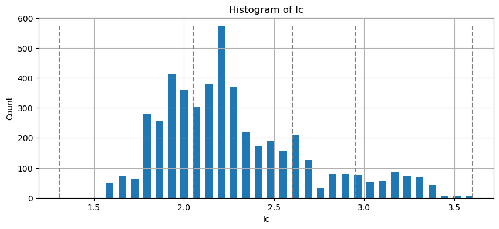

**Machine Learning in Geotechnical Engineering**

**Soil Layering by Cone Penetration Test Data**

Zhiyan Jiang
([LinkedIn.com/in/zhiyanjiang](http://linkedin.com/in/zhiyanjiang))

May 27 2025

# 1. Introduction

Accurate subsurface characterization is essential for foundation and
ground improvement design in geotechnical engineering. Given the
inherent spatial heterogeneity of soil deposits, soil properties often
vary significantly with depth within a site. To support effective and
reliable design, geotechnical engineers often segregate subsurface
profiles into a finite number of layers, each assumed to be internally
homogeneous and assigned representative soil properties. This process –
commonly referred to as soil layering - relies on data acquired during
subsurface investigations. Typical sources of geotechnical data include
standard penetration test (SPT) blow counts, laboratory-based soil
classification and index properties, and measurements of tip and sleeve
resistances from cone penetration test (CPT), among others.

The SPT is widely employed due to its adaptability across diverse soil
types and its ability to retrieve physical samples. However, its
sampling intervals – typically 2.5 ft for upper 10 feet soil and
5.0 feet for thereafter – are relatively coarse. This low sampling
resolution often leads to insufficient profile accuracy,
underrepresentation of thin layers, and unreliable estimates of
stiffness. Additionally, SPT blow counts tend to exhibit considerable
variability, which can obscure the identification of layer boundaries
and transition zones. These limitations motivate the exploration of
alternative data sources for soil stratification.

In contrast, CPT involves continuous penetration of an instrumented
electronic cone into the ground, during which tip resistance, sleeve
friction, and pore water pressure on sleeve are recorded in real time.
The CPT offers significantly higher resolution, by which typical data
intervals are as small as 0.065 ft (2.0 cm). Furthermore, CPT
measurements are generally more continuous and less variable than those
from the SPT, making CPT data particularly promising for applications
requiring detailed stratigraphic resolution.

The objective of this project is to investigate the feasibility of
automating soil layering using unsupervised machine learning techniques
applied to CPT data. The outcomes aim to contribute to the broader
development of automated geotechnical analysis workflows, with the
potential to enhance both the efficiency and consistency of subsurface
characterization in practice.

# 2. Methodology

## 2.1 Problem statement

Given one or more CPT profiles containing cone resistance and sleeve
friction measurements, the objective is to segment the soil subsurface
into the smallest number of distinct soil layers that both capture
essential geotechnical features and exhibits a high degree of internal
homogeneity. This problem can be formulated as a clustering task subject
to a continuity constraint. Specifically, data points with similar cone
tip resistance and sleeve friction values should be assigned into the
same cluster, while maintaining depth-wise contiguity within each
cluster. That is, clusters must consist of continuous intervals along
the depth axis and cannot be fragmented or overlap with one another.

## 2.2 Dataset 

The primary data source used in this project is Reference 1, which
consists of 984 publicly available cone penetration test records
collected from various sites across North America. This dataset was
selected because of its large volume, uniform formatting, and
comprehensive documentation. For the purposes of this study, the No.4
and No.5 datasets (as identified in Reference 2) are used for analysis.
As pore water pressure (u<sub>2</sub>) measurements are not included in
the original datasets, they are assumed to be zero at all depths
throughout this analysis.

## 2.3 Code Implementation

All computation and analyses are conducted in a Jupyter Notebook
environment, utilizing Python version 3.9.19 with Visual Studio Code.
Key external libraries are Scikit-learn, Numpy, Pandas, Matplotlib,
SciPy, and Shapely. The complete source code and reproducibility
instructions are available at:

<https://github.com/Drzyjiang/ML-in-Geotechnical-Engineering/tree/main/Soil%20Layering%20by%20Cone%20Penetration%20Test%20Data/Code>

## 2.4 Preprocessing

### 2.4.1 Data extraction

This project utilizes input data in .csv format, structured with column
headers including “Depth (ft)”, “Cone resistance (tsf)”, “Sleeve
friction (tsf)”, and “Pore pressure u2 (psi)” (Figure 1). Because the
original data is distributed in .mat and .pkl formats, a MATLAB script
is developed and provided for converting these formats into a
standardized .csv file.

<figure>

<figcaption><p>Figure 1 Preview of standardized .csv format supported by
this project</p></figcaption>
</figure>

### 2.4.2 Data filtering

In practical applications, CPT measurements often contain irregular
fluctuations, which do not reflect true stratigraphic transitions. To
mitigate these effects, a moving average (window) function is applied to
smooth the raw cone resistance and sleeve friction profiles. The window
length must be carefully selected: one that is too short may fail to
suppress noise, while an excessively long window may obscure important
stratigraphic features. In this project, a single-pass averaging is
applied with a window length as 3.0 ft, which effectively balances noise
reduction with signal fidelity.

Although the moving average is effective in suppressing cyclic
fluctuations, it is less effective against narrow, high-amplitude
spikes. Such spikes often correspond to thin, erratic interbeds that are
typically negligible in soil layering with thickness less than 2 ft. A
spike removal algorithm was developed to remove these features; However,
due to the complexity of overlapping or nested spikes in real-world
data, this method remains under development and is not employed in this
analysis.

### 2.4.3 Correct cone resistance

Cone resistance $`q_{c}`$ is often corrected to tip resistance $`q_{t}`$
by accounting for pore water pressure $`u_{2}`$, using the following
equation:

``` math
q_{t} = q_{c} + u_{2}(1 - a_{n})
```

where $`q_{t}`$ is corrected tip resistance (tsf);

$`q_{c}`$ is measured cone resistance (tsf);

$`u_{2}`$ is pore pressure (tsf);

$`a_{n}`$ is cone area ratio.

The raw cone resistance and sleeve friction and the preprocessed
profiles are compared in Figure 2.

<figure>

<figcaption><p>Figure 2 Comparison of raw and preprocessed
data</p></figcaption>
</figure>

# 3. Clustering

Prior work (Reference 3) has demonstrated that decision tree and random
forest models are effective in clustering one-dimensional geotechnical
data, particularly when a continuity constraint on depth is enforced.
This study extends that approach to CPT data, evaluating the performance
of these models under similar constraints. Depending on whether the soil
labels are treated as categorical or numerical, either a classifier or a
regressor is employed. For simplicity, the number of soil layers, (i.e.,
clusters) is specified as four. This value can be refined through
sensitivity analysis if needed.

## 3.1 Decision tree

A decision tree is a hierarchical model that segments data using a
series of rule-based splits, forming a tree-like structure. The internal
(non-leaf) nodes define the sequence of splitting criteria, while the
leaf nodes represent the final clusters – interpreted here as soil
layers. With depth as the sole input feature, each split corresponds to
a transition depth in the stratigraphy. The splitting rule is selected
by optimizing an objective function - such as maximizing information
gain (for classification) or minimizing variance (for regression).

A key consideration is the selection of label features for clustering.
In this study, three representations are examined:

- Tip resistance and sleeve friction in logarithmic scale;

- Soil behavior type index (*I<sub>c</sub>*);

- Soil behavior type category.

Because depth is the only feature used for tree construction, feature
selection randomness does not apply to the decision tree model in this
context.

### 3.1.1 Regression on tip resistance and sleeve friction in logarithmic-scale

A straightforward way is to apply decision tree regression model
directly to CPT tip resistance and sleeve friction data. However, domain
knowledge suggests that soil type is more closely associated with these
parameters when expressed in logarithmic scale. This is consistent with
the formulation of the Soil Behavior Type Index (*I<sub>c</sub>*) and
the normalized soil behavior type classification chart. Therefore, in
this implementation, the preprocessed tip resistance and sleeve friction
are transformed to log-scale prior to modeling fitting.

The resulting decision tree regressor identifies three transition depths
– rounded to 5.0 ft, 23.0 ft, and 26.0 ft – producing four distinct
layers. These results are illustrated in Figure 3. The first layer (0-5
ft) captures a very stiff near-surface stratum, while the second layer
(5-23 ft) likely correspond to a cohesive deposit. However, the third
layer (23-26 ft) appears trivial and may represent a transitional zone
with limited geotechnical significance. Notably, a prominent transition
observed at approximately 71 ft is not captured by the model, suggesting
limitations in this approach.


Figure 3 Results (in yellow) of decision tree regression on tip
resistance and sleeve friction in log-scale

### 3.1.2 Regression on soil behavior type index

One of the most widely adopted approaches for soil classification in CPT
interpretation is the use of the Soil Behavior Type Index $`I_{c}`$,
which is derived from cone tip resistance and sleeve friction data.
While raw tip resistance and sleeve friction measurements contain
information on range of soil properties, the index $`I_{c}`$ offers a
transformation grounded in geotechnical domain knowledge that isolates
soil behavior characteristics, effectively filtering out unrelated
variability.

The formulation of $`I_{c}`$ is computed as follows (Reference 4):

``` math
I_{c} = {({(3.47 - logQ_{tn})}^{2} + {(logF_{r} + 1.22)}^{2})}^{0.5}
```

where $`Q_{tn}`$ is normalized cone penetration resistance
(dimensionless), and $`F_{r}`$ is normalized friction ratio (in %),
defined as:

``` math
F_{r} = \frac{f_{s}}{q_{t} - \sigma_{vo}} \cdot 100
```

The normalized resistance $`Q_{tn}`$ is calculated iteratively by
incorporating the initial stress exponent $`n`$, as shown below:

``` math
n = 0.381\left( I_{c} \right) + 0.05\left( \frac{\sigma_{vo}'}{p_{a}} \right) - 0.15 \leq 1.0
```

``` math
C_{N} = {(\frac{p_{a}}{\sigma_{vo}'})}^{n}
```

``` math
Q_{tn} = \left\lbrack \frac{(q_{t} - \sigma_{vo})}{p_{a}} \right\rbrack \cdot C_{N}
```

where $`\sigma_{vo}`$ and $`\sigma_{vo}'`$ are total and effective
vertical stress*,* respectively; $`p_{a}`$ is atmospheric pressure; and
$`C_{N}`$

is a correction factor based on overburden stress.

The computed $`I_{c}`$ profile and its corresponding decision tree
regression results are illustrated in Figure 4, and its distribution is
summarized via a histogram in Figure 5.

Based on the $`I_{c}`$ interpretation, the following stratigraphic units
are identified:

- From 0-13 ft: a sand mixture layer with gradually increasing silt
  content;

- From 13-26 ft: a cohesive (clay) layer;

- From 26-70 ft: a sand mixture layer with increasing silt proportion;

- At ~70 ft: a transition into a silt-dominant layer.

<figure>

<figcaption><p>Figure 4 Results of decision tree regressor model trained
on <em>I<sub>c</sub></em></p></figcaption>
</figure>

<figure>

<figcaption><p>Figure 5 Histogram of soil behavior type index <span
class="math inline"><em>I</em><sub><em>c</em></sub></span></p></figcaption>
</figure>

A decision tree regression model is applied by treating $`I_{c}`$ as a
continuous variable. The resulting model successfully captures the three
major transition depths at 13 ft, 26 ft, and 70 ft, corresponding to
significant changes in soil behavior. Importantly, the model avoids
overfitting by not assigning separate clusters to trivial or ambiguous
transition zones. The predicted stratigraphy is consistent with the
known geotechnical behavior reflect in the CPT data.

### 3.1.3 Classification on simplified soil behavior type

Robertson (2010) proposed an updated the classification system for
Normalized Soil Behavior Type (SBTn), which partitions soil into nine
zones based on normalized cone penetration parameters. Among these, six
zones can be directly associated with specific ranges of the Soil
Behavior Type Index *I<sub>c</sub>*. This study adopts a simplified
classification scheme that maps *I<sub>c</sub>* values to categorical
zone numbers, as summarized in Table 1. It is worth noting that using
*I<sub>c</sub>* is a simplification, as the complete SBTn classification
typically requires interpretation from the Q<sub>tn</sub>-F<sub>r</sub>
chart (Figure 15).

<table>
<caption><p>Table 1 Association of soil behavior types with
Ic</p></caption>
<colgroup>
<col style="width: 19%" />
<col style="width: 47%" />
<col style="width: 33%" />
</colgroup>
<thead>
<tr>
<th><strong>Zone</strong></th>
<th><strong>Soil Behavior Type</strong></th>
<th><strong>Ic</strong></th>
</tr>
</thead>
<tbody>
<tr>
<td>1</td>
<td>Sensitive, fine grained</td>
<td>N/A</td>
</tr>
<tr>
<td>2</td>
<td>Organic soils – clay</td>
<td>&gt; 3.60</td>
</tr>
<tr>
<td>3</td>
<td>Clays – silty clay to clay</td>
<td>2.95 – 3.60</td>
</tr>
<tr>
<td>4</td>
<td>Silt mixtures – clayey silt to silt clay</td>
<td>2.60 – 2.95</td>
</tr>
<tr>
<td>5</td>
<td>Sandy mixtures – silty sand to sandy silt</td>
<td>2.05 – 2.60</td>
</tr>
<tr>
<td>6</td>
<td>Sands – clean sand to silty sand</td>
<td>1.31 – 2.05</td>
</tr>
<tr>
<td>7</td>
<td>Gravelly sand to dense sand</td>
<td>&lt; 1.31</td>
</tr>
<tr>
<td>8</td>
<td>Very stiff sand to clayey sand</td>
<td>N/A</td>
</tr>
<tr>
<td>9</td>
<td>Very stiff, fine grained</td>
<td>N/A</td>
</tr>
<tr>
<td colspan="3"><p>Notes:</p>
<p>1. N/A stands for not applicable.</p></td>
</tr>
</tbody>
</table>

Using the classification in Table 1, *I<sub>c</sub>* values are
converted to discrete zone numbers, which serve as categorical labels
for training a decision tree classifier. The trained model is then
applied to predict the simplified SBTn zone at each depth. For visualize
purposes, each categorical zone is mapped to the midpoint of its
corresponding *I<sub>c</sub>* range, and the resulting profile is
plotted in Figure 6. The classifier successfully identifies the cohesive
layer at approximately 13 ft depth. However, the bottom cohesive layer –
observed in other methods – is labeled as sandy, suggesting
misclassification. Overall, the decision tree classifier performs
reasonably well in capturing major stratigraphic changes. Nevertheless,
due to its reliance on fixed *I<sub>c</sub>* thresholds, the model may
misclassify gradual transitions where *I<sub>c</sub>* values hover near
class boundaries. In such cases, the model assigns different categorical
labels to data points with marginal differences, leading to artificial
discontinuities in the predicted stratigraphy.

<figure>

<figcaption><p>Figure 6 Classification results by decision tree model
trained on simplified soil behavior type</p></figcaption>
</figure>

## 3.2 Random forests

Random forests represent an ensemble learning technique that enhances
predictive accuracy and model robustness by aggregating the results of
multiple decision trees trained on different subsets of the data. These
subsets are generated through a process known as bootstrap aggregating,
or bagging, which introduces variance among the trees by sampling the
training data with replacement. This mechanism effectively reduces
overfitting and improves generalization performance. Depending on the
nature of the target variable, random forests can be initialized as
either classifiers or regressors as needed. In this study, the ensemble
consists of 10 trees.

### 3.2.1 Regression on tip resistance and sleeve friction in log-scale

As an extension of the methodology described in Section 3.1.1, a random
forest regressor model is trained on logarithmic values of CPT tip
resistance and sleeve friction. The predicted results are superimposed
on the original data in Figure 7. The model successfully identifies a
cohesionless layer beginning at approximately 5 ft, and a cohesive layer
starting near 27 ft. However, instead of clearly delineating the bottom
cohesive layer at 71 ft – identified in other models – the random forest
emphasizes a narrow transition zone around 25 ft.


Figure 7 Regression results by random forests on tip resistance and
sleeve friction in log-scale

To investigate the decision-making behavior across the ensemble, the
splitting thresholds at each non-leaf node are extracted and shown in
Figure 8. These thresholds indicate transition depths between
neighboring layers. Most trees consistently identify consistent
transition depths at approximately 4 ft (Layer 1 to Layer 2), 22 ft
(Layer 2 to Layer 3), and 25 ft (Layer 3 to Layer 4). While there is a
strong consensus for the first two transitions, the final transition
shows greater variability, with some trees identifying it at around 77
ft.

<figure>

<figcaption><p>Figure 8 Splitting criteria by each tree in random
forests on tip resistance and sleeve friction in
log-scale</p></figcaption>
</figure>

The performance of decision tree and random forest regressors is
evaluated using coefficient of determination $`R^{2}`$:

``` math
R^{2} = 1 - \frac{RSS}{TSS}
```

where $`RSS`$ is the residual sum of squares:

``` math
RSS = \ \sum_{I}^{}{(y_{i} - f_{i})}^{2}
```

$`TSS`$ is the total sum of squares and computed as,

``` math
TSS = \ \sum_{I}^{}{(y_{i} - \widehat{y})}^{2}
```

$`y_{i}`$ is observed data; $`\widehat{y}`$ is the mean of observed
data; $`f_{i}`$ is the predicted data.

A sensitivity study is performed to determine the optimal the number of
clusters (i.e., leaf nodes) by comparing *R<sup>2</sup>* between the
decision tree and the random forests models. The results, presented in
Figure 9, indicate a negligible improvement in prediction accuracy as
the number of clusters increases from 2 to 4. Beyond four clusters, the
rate of improve improves, and gains become negligible again once the
number of clusters exceeds 12. Overall, the random forests model
demonstrates slightly superior performance compared to the single
decision tree model.

<figure>

<figcaption><p>Figure 9 Comparison between decision tree and random
forests model trained on tip resistance and sleeve
friction</p></figcaption>
</figure>

### 3.2.2 Regression on normalized soil behavior type index

A random forests regressor model is employed to predict the normalized
soil behavior type index *I<sub>c</sub>*. The regression results,
presented in Figure 10, exhibit strong agreement with the original
dataset and reveal four distinctive interbedded layers – two cohesive
and two cohesionless. The model successfully captures the major
transitions between these layers, with approximate depth changes
observed at 13, 26, and 70 ft.

To further investigate the model’s internal decision logic, the
splitting criteria of individual trees within the random forest ensemble
are illustrate in Figure 11. All constituent trees consistently
identified the same transition depths, suggesting robust model
consensus.

A sensitivity analysis was also conducted to evaluate the influence of
the number of layers on model performance. The results of this analysis
are summarized in Figure 12, highlighting the advantages of ensemble
learning over a single decision tree.

<figure>

<figcaption><p>Figure 10 Regression results by random forests model
trained on normalized soil behavior type index</p></figcaption>
</figure>

<figure>

<figcaption><p>Figure 11 Splitting criteria by each tree in random
forests on normalized soil behavior type index</p></figcaption>
</figure>

<figure>

<figcaption><p>Figure 12 Comparison between decision tree and random
forests models trained on soil behavior type index</p></figcaption>
</figure>

### 3.2.3 Classification on Normalized Simplified Soil Behavior Type

To improve classification performance over the single decision tree used
in Section 3.1.3, a random forest classifier was implemented to predict
the simplified soil behavior type at varying depths. As shown in Figure
13, the model identifies transition depths at approximately 13, 28, and
62 ft. Consistent with the previous decision tree results, the second
layer is classified as cohesive, while the remaining layers are
classified as cohesionless.

The splitting logic used by the individual decision trees in the
ensemble is visualized in Figure 14. All trees yield consistent
stratigraphic interpretations, supporting the validity and stability of
the classification outcome.

<figure>

<figcaption><p>Figure 13 Results of random forests classifier trained on
simplified soil behavior type</p></figcaption>
</figure>

<figure>

<figcaption><p>Figure 14 Splitting criteria by each tree in random
forests classifier model trained on simplified soil behavior
type</p></figcaption>
</figure>

3.2.4 Random forests based on soil behavior type

In Section 3.2.3, a random forests classifier model is trained on
simplified soil behavior type derived from the normalized soil behavior
type index *I<sub>c</sub>*. As an alternative and more rigorous
approach, the soil behavior type can be determined using the normalized
cone penetration parameters Q<sub>tn</sub> and F<sub>r</sub>, as
depicted in Figure 15. Both axes in this chart represent normalized
quantities, making it a more robust tool for soil classification.

<figure>

<figcaption><p>Figure 15 Q<sub>tn</sub>-F<sub>r</sub> chart with soil
behavior type zone numbers (Reference 4)</p></figcaption>
</figure>

Compared to the soil behavior type index, the
Q<sub>tn</sub>-F<sub>r</sub> chart offers several advantages. Notably,
it differentiates between soil types that *I<sub>c</sub>* cannot
resolve, such as sensitive fine-grained soils (Zone 1), very stiff sand
to clayey sand (Zone 8), and very stiff fine-grained soils (Zone 9). The
also enhances classification accuracy in transitional soils, including
clays (Zone 3), silt mixtures (Zone 4), and stiff fine-grained soils
(Zone 9). While the index *I<sub>c </sub>*generally correlates with fine
content – high values indicating higher fines – the chart provides a
two-dimensional framework. Changes in fines contents are typically
observed along the diagonal direction, whereas changes in soil stiffness
occur orthogonally.

To enable classification, each zone on the Q<sub>tn</sub>-F<sub>r</sub>
chart was digitized into a polygon defined by a finite set of boundary
points. Care was taken to ensure no voids or overlaps between adjacent
zones by requiring that shared vertices lie on common boundaries. Using
the Shapely library, each data point was effectively assigned a zone
number by checking its inclusion within the appropriate polygon. For
visual classification, data points were color-coded by zone and overlaid
onto the original chart, as shown in Figure 16.

<figure>

<figcaption><p>Figure 16 Verification of zone numbers of each data
point</p></figcaption>
</figure>

Subsequently, a random forests classifier was trained using depth as the
sole input feature and the assigned zone number as the target label. The
classification results are presented in Figure 17. Points from Layer 0
predominantly reside in Zone 8, transitioning through Zone 5 (sandy
mixture) and 4 (silt mixture). Layer 1 includes points spanning Zone 5
and 6 (sands), while Layer 2 is primary in Zone 5. Data in Layer 3 also
mainly within Zone 5 and 4. These results suggest that certain layers
span over across multiple zones, revealing that it is hard to enforce a
unique zone number for each layer.

The splitting criteria for individual trees within the random forest
model are displayed in Figure 18. Most trees consistently identify
transition depths at approximately 28, 61, and 71 ft. However, some
variation exists. For example, Tree 3 and Tree 9 identify 12 ft as the
first transition depth - a reasonable outcome given the
cohesionless-to-cohesive soil transition at that depth. Conversely, the
transition between 61 and 71 ft is less significant, as neither tip
resistance, sleeve friction, nor *I<sub>c</sub>* values show pronounced
variations in that interval.


Figure 17 Results of random forests classifier trained on soil behavior
type

<figure>

</figure>

Figure 18 Splitting criteria by each tree in random forests classifier
model trained on soil behavior type

3.3 Reduction of random forests splitting criteria

In practice, individual trees within a random forests model may produce
divergent splitting criteria, complicating the interpretation of
stratigraphic boundaries. This variability is expected, given the
heterogeneity inherent in real-world subsurface data. Consequently, a
post-processing reduction procedure is required to derive a consistent
and interpretable soil layering scheme. In this study, two complementary
reduction methods are developed and employed in tandem.

The first method involves aligning the splitting depths of each tree and
computing the median value at each corresponding position in the split
sequence. Specifically, the splitting depths from each tree are sorted
in ascending order, and for each split index (e.g., first, second,
third), the median value among all trees is selected as the
representative transition depth. This approach mitigates the influence
of outlier and reduces the likelihood of false positive due to errant or
extreme splits. However, a key limitation of this method is its
sensitivity to offset in the sequence of transition depths across trees.
That is, even if a tree incorrectly identifies the first transition
depth, its subsequent splits may still correspond meaningfully with
other trees.

Take Figure 18 for example, Tree 3 and Tree 9 deviate from the majority
by voting for a first transition depth at approximately 13 ft rather
than 28 ft. However, upon a closer look, the second and the third
transition depths from these two trees align closely with the first and
the second transitions identified by the remaining trees. This shift is
likely due to bootstrapped variation in training data. Thus, the second
and third splits from Tree 3 and Tree 9 should be interpreted as an
agreement with other trees, rather than deviations.

To address this sequential offset issue, a second reduction method is
applied. Rather than sorting and indexing the splitting depths, all
split values across the ensemble are aggregated and subject to
agglomerative hierarchical clustering. The number of clusters in the
model is set equal to the number of leaves in the original random
forest. Through this clustering process, similar transition depths from
different trees are grouped, effectively consolidating votes and
reducing noise. This method captures repeated patterns in the splitting
criteria without relying on strict positional alignment, thereby
producing a more robust and coherent representation of the stratigraphy.

# 4. Verification

The performance of unsupervised machine learning models trained on cone
penetration test data is evaluated using two primary metrics: accuracy
and simplicity. However, unsupervised learning inherently lacks labeled
ground truth, complicating direct validation of soil layering
predictions. In this project, verification is ideally performed using
supplementary data sources – such as standard penetration test blow
counts, laboratory-derived soil classifications, moisture content,
plasticity indices, and shear strength parameters – to establish a more
rigorous ground truth. Due to the unavailability of these supporting
datasets, an alternative approach is adopted.

A professional geotechnical engineer, leveraging domain expertise and
empirical experience, provided an expert-based soil profile
interpretation. This professional judgement is used as a reference
baseline for evaluating the model results. According to this assessment:

- The first transition occurs at approximately 5 ft, indicating a change
  from clean sand to sandy mixture;

- The second transition is identified at 27 ft, marking a shift from
  clay to sand;

- The third transition occurs at approximately 70 ft, denoting a
  boundary between silty and silt;

Table 2 presents a comparative summary of the transition depths
identified by each machine learning model alongside the expert
interpretation.

Across all models, the second transition near 23-28 ft is consistently
identified. Models trained on tip resistance and sleeve friction (in
log-scale) successfully detect the first transition at 5 ft, whereas
models trained on soil behavior type index (*I<sub>c</sub>*) or
simplified soil behavior type tend to identify the first transition
around 13 ft, likely reflecting sensitivity to changes in fine content.

The third transition depth exhibits greater variation. Models trained on
soil behavior type index and full soil behavior type
(Q<sub>tn</sub>-F<sub>r</sub>) correctly place the transition near 70-71
ft, aligning closely with professional judgement. In contrast, models
trained on simplified soil behavior type suggest a shallower depth (~62
ft), and those based on tip resistance and sleeve friction overlook this
transition altogether, possibly due to scale compression in
log-transformed features.

Among the evaluated models, the random forests regressor trained on the
soil behavior type index exhibits the best alignment with expert
interpretation, followed by the random forests classifier trained on
soil behavior type zones. Conversely, models based on simplified soil
behavior type exhibit the lowest accuracy. This is attributed to the
fixed nature of Ic-based zone thresholds, which as noted in Reference 4,
may involve overlapping or ambiguous boundaries and often require
regional calibration. Without such tuning, the simplified soil behavior
type model, which relies on a single scalar index, becomes susceptible
to misclassification.

| **Model** | **Labels** | **Transition 1 (ft)** | **Transition 2 (ft)** | **Transition 3 (ft)** |
|:--:|:--:|:--:|:--:|:--:|
| Decision tree regressor | Tip resistance and sleeve friction (log-scale) | 5.0 | 23.0 | 26.0 |
| Decision tree regressor | Soil behavior type index | 13.0 | 26.0 | 70.0 |
| Decision tree classifier | Simplified soil behavior type | 13.0 | 28.0 | 62.0 |
| Random forests regressor | Tip resistance and sleeve friction (log-scale) | 5.0 | 23.0 | 26.0 |
| Random forests regressor | Soil behavior type index | 13.0 | 26.0 | 70.0 |
| Random forests classifier | Simplified soil behavior type | 13.0 | 28.0 | 62.0 |
| Random forests classifier | Soil behavior type | 25.0 | 62.0 | 71.0 |
| Professional judgement | \- | 5.0 | 23.0 | 71.0 |

Table 2 Comparison of machine learning results and professional
judgement

In general, model limitations arise from challenges in detecting
gradational transitions: some models fail to detect significant changes
(false negatives), while others exaggerate minor fluctuations (false
positives). There results highlight the importance of incorporating
domain expertise and auxiliary data when interpreting machine learning
outputs in geotechnical applications.

# 5. Conclusions

This project investigates the use of unsupervised machine learning
models to automate soil stratification based on cone penetration test
(CPT) data. A total of seven models – including decision tree and random
forests regressor and classifier – were developed and trained using
various input features and label representations informed by
geotechnical domain knowledge.

Among the evaluated models, the random forests regressor trained on the
soil behavior type index (*I<sub>c</sub>*) demonstrated the most
consistent and accurate performance in identifying subsurface transition
depths. The random forests classifier model trained on soil behavior
type zones (Q<sub>tn</sub>-F<sub>r</sub>) followed as the next
best-performing approach. Both models show strong alignment with
expert-derived stratigraphic interpretations.

The findings highlight the feasibility and effectiveness of applying
ensemble-based machine learning techniques, particularly random forests,
for data-driven soil profiling in geotechnical engineering. The
integration of domain-specific indices and expert-informed labeling
schemes is shown to enhance model interpretability and performance.
These insights contribute to the growing body of research at the
intersection of geotechnical data analytics and artificial intelligence,
and lay the groundwork for more robust, automated subsurface
characterization frameworks.

# 6. References

1\. Sanger, M., M. Geyin, A. Shin, B. Maurer (2024). *A Database of Cone
Penetration Tests from North America*.
DesignSafe-CI. <https://doi.org/10.17603/ds2-gqjm-t836>

2\. BergerABAM. (2017). *Stormwater System Conceptual Design Report:
Strander Grade Separation Phase 3.*

3\. Jiang, Z. Machine Learning on Geotechnical Engineering – Soil
Layering by Pile Driving Records.

4\. Gregg. Guide to Cone Penetration Testing. 6<sup>th</sup> Ed, 2015.

5\. Robertson, P.K., 2010. Soil behaviour type from the CPT: an update.
*2<sup>nd</sup> International Symposium on Cone Penetration Testing*,
*CPT’10*, Huntington Beach, CA, USA.
[www.cpt10.com](http://www.cpt10.com).
