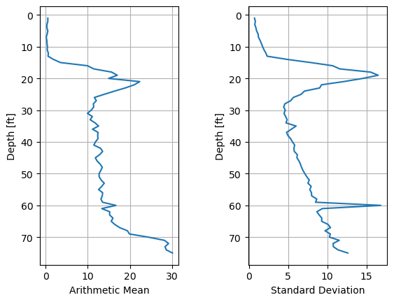

**Machine Learning in Geotechnical Engineering**

**Soil Layering by Pile Driving Records**

Zhiyan Jiang
([LinkedIn.com/in/zhiyanjiang](http://linkedIn.com/zhiyanjiang))

Mar.2, 2025

# **1. Introduction**

Geotechnical information is fundamental for foundation design in civil
engineering. Due to the inherent spatial variations in soil strata, the
soil properties within a given area of interest typically change with
depth. To support effective foundation design, geotechnical engineers
often partition soil strata into a finite number of discrete layers,
each assumed to exhibit sufficient homogeneity to be assigned constant
soil properties. This process, known as soil layering, relies on
geotechnical data obtained during subsurface investigation phase. The
most commonly used data sources include standard penetration test (SPT)
blow counts, soil classifications, and tip and sleeve resistances
recorded during the cone penetration tests (CPT).

However, subsurface investigation locations, particularly in the initial
phases of a project, are often spatially sparse. For example, soil
boring spacing requirements can be as large as 150 ft for sites with
relatively simple geotechnical conditions. Additionally, SPT blow counts
are typically recorded at 5-ft intervals starting at a depth of 10 ft,
resulting in considerable vertical gaps in data. Consequently, soil
layering based on solely on such sparse data may fail to accurately to
capture the complexity of soil conditions. Therefore, it is advantageous
to explore supplementary data sources for soil layering.

One promising data source is the incremental blow counts recorded during
pile installation. Incremental blow counts, which reflect the number of
hammer blows required to advance a pile by a unit depth (e.g., per
foot), are generally positively correlated with the stiffness or
strength of the soil layers encountered. As a common form of deep
foundation, driven piles are typically installed in groups with small
horizontal spacing. For quality assurance purposes, geotechnical
professionals record incremental blow counts for each pile, creating a
more densely spaced dataset in both horizontal and vertical directions
compared to SPT data. Moreover, pile driving records are routinely
documented to verify that the pile installation complies with design
specifications, ensuring the availability and reliability of these
records. Thus, incremental blow counts have the potential to reveal both
native and modified soil conditions in practical applications.

This project studies the feasibility of applying machine learning
algorithms to incremental blow counts for automated soil layering. The
findings aim to enhance the accuracy and efficiency of geotechnical
designs by providing a data-driven approach to soil stratification.

This project is implemented using Jupyter Notebooks within Visual Studio
Code environment. The Python interpreter version is 3.9.19. The major
external libraries utilized include Scikit-learn, Numpy, Pandas, and
Matplotlib. Detailed instructions for running the code are provided
below:

- The dataset can be found in
  <https://github.com/Drzyjiang/ML-in-Geotechnical-Engineering/tree/main/Soil%20Layering%20by%20Pile%20Driving%20Records>

- The source code can be found in
  <https://github.com/Drzyjiang/ML-in-Geotechnical-Engineering/tree/main/Soil%20Layering%20by%20Pile%20Driving%20Records>

- Run source code Soil Layering by Pile Driving Records.ipynb in Visual
  Studio Code or Jupyter Lab.

# **2. Methodology**

## 2.1 Problem statement

Given the incremental blow counts of multiple piles recorded during pile
installation, the objective is to partition the soil strata into a
predefined number of layers such that soils within each layer exhibit
maximum homogeneity. This task can be framed as a clustering problem
with a continuity constraint. Specifically, soils with similar
incremental blow counts should be grouped together, while ensuring that
the layers remain contiguous in terms of depth. In other words, a
cluster cannot overlap with or span across another cluster.

## 2.2 Dataset 

The dataset used in this project consists synthetic pile driving records
for a total of 34 piles. This dataset is selected because of its
representation of various common geotechnical soil conditions
encountered at numerous project sites.

The dataset contains 76 rows and 35 columns. The first row indicates the
pile IDs, ranging from 1 to 34. The first column of the remaining rows
represents the ending depth for each increment, while the rest of
entries correspond to incremental blow counts. The maximum depth
recorded is 75 ft. An illustration of the dataset is shown in Figure 1.
It is important to note that some piles were terminated at depths less
than 75 ft, and any missing incremental blowcounts are noted as \#N/A.

<figure>

<figcaption><p>Figure 1 Explanation of dataset format</p></figcaption>
</figure>

## 2.2 Preparation

### 2.2.1 Statistical analysis of raw data

Since the incremental blow counts were recorded at the same ending
depths for all piles, the arithmetic mean and the standard deviation of
each depth are calculated and are presented in Figure 2.



Figure 2 Arithmetic mean and standard deviation of incremental blow
counts in terms of depth

The statistical analysis reveals key trends in the data. For the
uppermost 13 ft of soils, the mean incremental blow counts are
predominantly zero, indicating minimal resistance during pile
installation. Between depths of 13 ft and 26 ft, the mean value
initially rise to a local maximum of 22 before declining to
approximately 12. From 26 and 60 ft, the mean values exhibit a slow yet
steady pace. Beyond 65 ft, the mean values escalate sharply, reaching a
peak of 30 at the maximum depth.

The standard deviation profile mirrors the mean trend, suggesting
greater variability in blow counts at deeper layers. Notably, while the
mean values rise sharply beyond 65 ft, the standard deviation displays a
more gradual upward trajectory, imply that deeper soils not only offer
greater resistance but also exhibit more consistent incremental blow
counts across piles.

### 2.2.2 Data preprocessing

To develop a site-wide layering model using all pile driving records,
the data from all piles are aggregated together into {depth, incremental
blow count} pairs, disregarding pile IDs. This aggregation yielded a
total of 2,550 data pairs. After excluding pairs with missing
incremental blow counts (#N/A), the remaining 2,527 pair of data points
are valid points remained for analysis. The preprocessed dataset is
shown in Figure 3.

<figure>

<figcaption><p>Figure 3 Dataset after preprocessing</p></figcaption>
</figure>

Due to the overlap of data points from 34 piles in Figure 3, it is
challenging to clearly visualize the distribution of incremental blow
counts at each depth. To address this, Figure 4 represents the
25<sup>th</sup> and 75<sup>th</sup> percentile blow count profiles at
each depth, offering a clearer depiction of the spread of data.

<figure>

<figcaption><p>Figure 4 25<sup>th</sup> and 75<sup>th</sup> percentile
blow count profiles</p></figcaption>
</figure>

The incremental blow count profiles suggest the presence of distinct
soil layers: a very soft or loose layer above 20 ft, a thin and very
stiff soil layer, a relatively homogeneous intermediate layer with
moderate strength, and a stiff bottom layer. Based solely on these
profiles, an experienced geotechnical engineer might subjectively divide
the strata into four or five layers. Guided by these observations,
subsequent analyses in this study focus on partitioning the soil into
five layers for simplicity and consistency.

## 3. Clustering

Multiple clustering techniques are examined for their applicability in
the following sections.

### 3.1 Agglomerative clustering

Agglomerative clustering and divisive clustering are two types of
hierarchical clustering. While divisive clustering adopts a top-down
approach, agglomerative clustering builds clusters in a bottom-up
manner. The iterative process of agglomerative clustering can be
summarized as follows: initially each data point is treated as an
individual cluster. At each iteration, the two clusters with shortest
distance between them are merged, reducing the total number of clusters
by one. This process repeats until the number of clusters equals the
specified value – the number of soil layers in this study.

The distance between two clusters, known as the linkage criterion, can
be defined in several ways:

- *Ward’s minimum variance*: based on normalized distance between two
  cluster centroids.

``` math
\Delta\left( C_{i},C_{j} \right) = \frac{\left| C_{i} \right|\left| C_{j} \right|}{\left| C_{i} \right| + \left| C_{j} \right|}\left\| \overline{x_{i}} - \overline{x_{j}} \right\|^{2}
```

where $`\left| C_{i} \right|`$ and $`\left| C_{j} \right|`$ are number
of points of clusters $`i`$ and $`j`$, and $`\overline{x_{i}}`$ and
$`\overline{x_{j}}`$ denote their.

- *Complete linkage:* defined by the maximum distance between any pair
  of points in the two clusters.

- *Average linkage*: based on the average distance between all pairs of
  points across clusters.

- *Single linkage*: uses the minimum distance between any pair of points
  across clusters.

In this project, the Ward’s minimum variance criterion is adopted.
Agglomerative clustering is employed as it proves feasible given the
nature of the data. As shown in Figure 3, the distance between two data
points depends on the differences in depths and incremental blow count
values. A small difference in depth implies spatial proximity of the
soils, while a small difference in incremental blow count values
suggests similar soil strength or stiffness.

However, a challenge arises when a data point exhibits significantly
higher or lower incremental blow counts value compared to its adjacent
points. In such cases, the small difference in depth may overshadow the
variation in blow count values, leading to a scenario where the upper
and lower points bypass the middle point and directly link together.
This violates the continuity requirement. To mitigate the impact
resulting from the range disparity between incremental blow count values
(ranging from 0 to 100+) and incremental depths (fixed at 1), both
variables are normalized to \[0,1\], as illustrated in Figure 5.


Figure 5 Normalized dataset

The agglomerative clustering result is presented in Figure 6. Overall,
the clustering outcome appears to be reasonable. The first layer spans
from 0 to 20 ft, capturing the very soft layer at top. The second layer
extends from 14 to 35 ft, representing the thin and stiff layer. The
third and fourth layers reflect relatively homogeneous strata with
constant stiffness. Finally, the last layer ranges from 59 to 75 ft,
representing the stiff bottom layer. Notably, the clusters have
noticeable overlap in depth. For instance, there is a 10-ft overlap
between layer 2 and layer 3. This overlap is justifiable, as transitions
between soil layers in practice tend to be gradual rather than abrupt.
However, the extent of overlap is substantial, necessitating additional
steps to further delineate the transition zones and refine the cluster
boundaries.

<figure>

<figcaption><p>Figure 6 Results of agglomerative
clustering</p></figcaption>
</figure>

### 3.2 K-Means clustering

K-Means is another distance-based clustering technique widely used for
partitioning data into a fixed number of clusters, denoted as K. The
primary objective of K-Means is to minimize the sum of squared distances
between each point and the centroid of its assigned cluster.
Mathematically, this objective function is expressed as:

``` math
J = \sum_{n = 1}^{N}{\sum_{k = 1}^{K}{\delta_{n,k}\left\| x_{n} - \mu_{k} \right\|^{2}}}
```

where $`x_{n}`$ denotes data point n, a vector corresponding to a
location in the vector space;

$`\mu_{k}`$ denotes the centroid of cluster *k*;

$`\delta_{n,k}`$ is the Dirac delta function, defined as:

``` math
\delta_{n,k} = \left\{ \begin{array}{r}
1,ifdata\ point\ n\ belongs\ to\ cluster\ k\  \\
0,\ otherwise
\end{array} \right.\ 
```

The goal is the iteratively determine $`\delta_{n,k}`$ and $`\mu_{k}`$.
The K-Means algorithm follows these steps:

1.  Initialize by randomly selecting K data points as the initial
    cluster centroids;

2.  For each remaining data point, calculate its distance to all cluster
    centroids and assign it to the nearest cluster;

3.  Update each cluster centroid as the mean of all points assigned to
    that cluster;

4.  Repeat steps 2 and 3 until either the cluster assignments
    $`{(\delta}_{n,k})`$ and centroids $`{(\mu}_{k})`$ converge, or a
    predefined maximum number of iterations is reached.

Unlike agglomerative clustering, which builds clusters incrementally by
merging the closest points one-by-one case. Therefore, K-Means
simultaneously assigns all points to clusters, reducing the bias towards
the initially closest points. The clustering results obtained using
K-Means are shown in Figure 7. Compared to agglomerative clustering,
K-Means produces less overlap between adjacent layers, facilitating
clearer layer delineation.

However, K-means has certain limitations. The clustering outcome is
sensitive to the random initialization of cluster centroids, which may
lead to inconsistent results. Thin soil layers near the ground surface
and bottom (depth = 0 and 75) may be incorrectly merged, while
homogeneous soil layers may be split into multiple clusters.

<figure>

<figcaption><p>Figure 7 Results by K-Means clustering</p></figcaption>
</figure>

### 3.3 Bisecting K-Means clustering

Bisecting K-Means clustering is a variation of the K-Means clustering
that combines elements of divisive hierarchical clustering with K-Means.
At each iteration, among all existing clusters, the one with highest
total sum of squared errors is selected for further division using the
“2-Means” approach. Consequently, the total number of clusters increases
by one in each step. This procedure is repeated until the specified
number of clusters is reached.

Compared with K-Means, bisecting K-Means is more stable due to the use
of a smaller cluster count (K=2) at each stage, which helps mitigate the
sensitivity to initial conditions. Additionally, bisecting K-Means does
not require a predetermined number of clusters, offering greater
flexibility during the clustering process. However, the primary drawback
is its computational cost, as each step only increases number of
clusters by one, requiring more steps to reach the final clustering
configuration.

The clustering results obtained by bisecting K-Means are showing in
Figure 8. The results are generally similar to those produced by
standard K-Means, with the primary difference being a lower depth for
Lay 1.

<figure>

<figcaption><p>Figure 8 Results of Bisecting K-Means</p></figcaption>
</figure>

### 3.4 Gaussian mixture model

Gaussian Mixture Model (GMM) is a model-based clustering technique that
assumes data is generated from a mixture of multiple Gaussian
distributions. The probability density function of a data point is a
modeled as:

``` math
f(\mathbf{x}) = \sum_{k = 1}^{K}\pi_{k}f_{k}(\mathbf{x}|\theta_{k})
```

where $`f(\mathbf{x})`$ is the probability density function for all data
points;

$`K`$ represents the number of Gaussian components; each corresponding
to a cluster;

$`f_{k}(\mathbf{x}|\theta_{k})`$ is the probability density function of
the k-th Gaussian component, parameterized by $`\theta_{k}`$;

$`\pi_{k}`$ is the weight for the *k*<sup>th</sup> Gaussian distribution
component, $`\sum_{k = 1}^{K}\pi_{k} = 1`$

Gaussian Mixture Models are commonly solved by the
Expectation-Maximization (EM) algorithm, which iteratively refines the
parameters to maximize the likelihood of the data given the model.

The clustering results obtained using the Gaussian Mixture Model are
shown in Figure 9. Class 2 captures the very soft top layer, while Class
4 identifies the thin and stiff layer at 20 ft deep. Class 0 and Class 3
together represent the homogeneous layer between 20 and 65 ft, and Class
1 corresponds to the bottom stiff layer.

The outcome of the Gaussian mixture model closely resembles those of
agglomerative clustering, with notable overlaps between layers. For
example, Class 4 can be entirely replaced by Class 2 and Class 0. In
addition, some data points with gaps between them are assigned to the
same cluster, indicating that the model accounts for underlying
probabilistic distributions rather than strictly enforcing spatial
continuity.

<figure>

<figcaption><p>Figure 9 Result by the Gaussian mixture
model</p></figcaption>
</figure>

### 3.5 Decision tree regression

A decision tree is a hierarchical model that partitions data using a
sequence of splitting rules, forming a tree-like structure. It consists
of both non-leaf nodes, which represents decision rules, and leaf nodes,
which correspond to clusters. Decision trees can be used for
classification or regression. At each non-leaf node, a splitting rule is
determined by evaluating a subset of candidate features, selecting the
one that maximizes information gain or minimizes variance. Given the
continuous nature of the incremental blow counts, a regression tree is
more suitable for capturing the underlying data distribution.

The goal is to minimize the total variance after split:

``` math
Variance(Var) = \ \frac{1}{n}\sum_{i = 1}^{n}{(y_{i} - \overline{y})}^{2}
```

``` math
Total\ variance\ after\ split = \frac{n_{L}}{n}Var\left( y_{L} \right) + \frac{n_{R}}{n}Var(y_{R})
```

where $`n_{L}`$ and $`n_{R}`$ are sizes of left and right cluster sizes,
respectively; $`n`$ is the total size. Then the average value of all
data points at a leaf node is assigned as the predicated value for that
node.

In this project, depth is used as feature, while incremental blow counts
serve as the label. By structuring the decision tree in this manner,
clusters are strictly segregated by depth without any overlap. Since
each data point has only one feature (depth), feature selection
randomness does not apply in this context.

The clustering results obtained using the decision tree method are shown
in Figure 10. The first very soft layer extends from 0 to 15 ft,
followed by a thin and stiff layer from 16 ft and 24 ft. A homogeneous
layer spans 25 to 63 ft, while the fourth layer is from 63 to 70 ft. The
bottom stiff layer is from 70 to 75 ft. Decision trees tend to maximizes
the thickness of the homogeneous layers before identifying transition
zones. Unlike other clustering techniques, decision trees clearly
delineate layers without overlap.

<figure>

<figcaption><p>Figure 10 Clustering results by decision
tree</p></figcaption>
</figure>

### 3.6 Random forests regression

Random forests extend decision trees by employing an ensemble learning
approach, where multiple decision trees are trained on different subsets
of the data. This method is effective for both classification and
regression tasks. The key distinction between a single decision tree and
the random forests lies in the use of bootstrap aggregation (bagging),
which reduces variance and improve model robustness.

Bootstrap aggregation involves constructing multiple datasets by
randomly sampling with replacement from the original dataset. Given an
initial dataset of *N* points, each bootstrap dataset is generated by
randomly selecting a data point and reinserting it, repeating this
process *N* times. Due to this random selection, each decision tree in
the ensemble is trained on a slightly different dataset, leading to
diverse predictions. The final output by the random forest regression is
obtained by averaging the predictions from all individual trees:

``` math
\widehat{y} = \ \frac{1}{B}\sum_{i = 1}^{B}y_{i}
```

where $`B`$ is the number of decision trees; $`y_{i}`$ is the prediction
by the i<sup>th</sup> tree; $`\widehat{y}`$ is the final aggregated
prediction.

In this study, the size of random forest is specified as 10. The
regression results are depicted in Figure 11. Although the figure
presents regression results rather than explicit clustering, distinct
layers can still be identified, including the very soft top layer, the
thin and very stiff layer, the homogeneous layer, and the bottom very
stiff layer.

<figure>

<figcaption><p>Figure 11 Regression results by random
forest</p></figcaption>
</figure>

To further illustrate the clustering pattern learned by individual
trees, the splitting criteria stored at each non-leaf nodes are
extracted and shown in Figure 12. These criteria represent depth-based
interfaces between different layers. Notably, most trees identify
consistent transition depths at approximately 15 ft (between Layer 1 and
Layer 2) and 70 ft (between Layer 4 and Layer 5). However, greater
variability is observed in the interfaces between Layer 2 and 3, as well
as between Layer 3 and 4, with some trees selecting depths of
approximately 17 and 24 ft, while others prefer 25 and 60 ft. This
divergence originates from variations in the original dataset, as
indicated by the standard deviation in Figure 2, which propagate through
the bootstrapped datasets.

<figure>

<figcaption><p>Figure 12 Clustering results by random
forest</p></figcaption>
</figure>

To evaluate the performance of decision tree and random forest
regression, the coefficient of determination is used as a metric:

``` math
R^{2} = 1 - \frac{RSS}{TSS}
```

where $`RSS`$ (Residual Sum of Squares) is given by:

``` math
RSS = \ \sum_{I}^{}{(y_{i} - f_{i})}^{2}
```

$`TSS`$ (Total Sum of Squares) is computed as,

``` math
TSS = \ \sum_{I}^{}{(y_{i} - \widehat{y})}^{2}
```

$`y_{i}`$ is observed data; $`\widehat{y}`$ is the mean of observed
data; $`f_{i}`$ is fitted data.

A sensitivity study is performed to study the influence of number of
clusters (leaf nodes) on the *R<sup>2</sup>* determination. The results
are shown in Figure 13. Coefficient of determination R<sup>2</sup>
increases as the number of clusters increases from 2 to 6. However,
beyond six clusters, no significant improvement is observed for either
the decision tree or random forest models. When compared to a cluster
count of fie, which was determined based on the domain knowledge, using
machine learning demonstrates potential for enhancing engineering
design. Overall, random forests achieve slightly higher R<sup>2</sup>
than the decision tree, indicating superior predictive accuracy.

<figure>

<figcaption><p>Figure 13 Results of sensitivity analysis on number of
clusters for decision tree and random forests</p></figcaption>
</figure>

# **4. Verification and Application**

In the previous section, six clustering and regression techniques are
evaluated for their applicability to pile driving records. The resulting
soil layering outcome are compared in Table 1. Some outliers are
manually excluded when determining the upper and lower depths of each
layer.

Among the six techniques, the random forests regression provides the
most reliable clustering results. To verify these results, an
experienced geotechnical engineer independently determines the soil
layering using domain knowledge, which serves as the ground truth in
this study. In addition, the layering derived from pre-production
geotechnical investigations, including Standard Penetration Tests (SPTs)
and Cone Penetration Tests (CPTs) are included for comparison. The
random forests closely match the ground truth, with the primary
discrepancy occurring at the interface between Layer 3 and Layer 4. This
difference is, however, negligible, as the soil properties in these two
layers exhibit similar incremental blow counts. Notably, the random
forests also align well with the design layering. The geotechnical
investigation allowed for further subdivision of Layer 2. More
importantly, the blow counts profile captures a very stiff bottom layer,
which is overlooked in the original design. These findings justify the
use of machine learning-based clustering on blow count data to extract
additional geotechnical insights.

<table>
<caption><p>Table 1 Comparison of machine learning results, ground
truth, and design values</p></caption>
<colgroup>
<col style="width: 19%" />
<col style="width: 14%" />
<col style="width: 23%" />
<col style="width: 15%" />
<col style="width: 14%" />
<col style="width: 13%" />
</colgroup>
<thead>
<tr>
<th style="text-align: center;"><strong>Technique</strong></th>
<th style="text-align: center;"><strong>Layer 1</strong></th>
<th style="text-align: center;"><strong>Layer 2</strong></th>
<th style="text-align: center;"><strong>Layer 3</strong></th>
<th style="text-align: center;"><strong>Layer 4</strong></th>
<th style="text-align: center;"><strong>Layer 5</strong></th>
</tr>
</thead>
<tbody>
<tr>
<td style="text-align: center;">Agglomerative clustering</td>
<td style="text-align: center;">[0, 20]</td>
<td style="text-align: center;">[14, 30]</td>
<td style="text-align: center;">[21, 51]</td>
<td style="text-align: center;">[46, 70]</td>
<td style="text-align: center;">[59, 75]</td>
</tr>
<tr>
<td style="text-align: center;">K-Means clustering</td>
<td style="text-align: center;">[0, 9]</td>
<td style="text-align: center;">[10, 24]</td>
<td style="text-align: center;">[15, 40]</td>
<td style="text-align: center;">[39, 62]</td>
<td style="text-align: center;">[57, 75]</td>
</tr>
<tr>
<td style="text-align: center;">Bisecting K-Means clustering</td>
<td style="text-align: center;">[0, 20]</td>
<td style="text-align: center;">[16, 26]</td>
<td style="text-align: center;">[16, 38]</td>
<td style="text-align: center;">[35, 61]</td>
<td style="text-align: center;">[56, 75]</td>
</tr>
<tr>
<td style="text-align: center;">Gaussian mixture model</td>
<td style="text-align: center;">[0, 20]</td>
<td style="text-align: center;">[11, 30]</td>
<td style="text-align: center;">[20, 44]</td>
<td style="text-align: center;">[39, 68]</td>
<td style="text-align: center;">[58, 75]</td>
</tr>
<tr>
<td style="text-align: center;">Decision tree</td>
<td style="text-align: center;">[0, 15]</td>
<td style="text-align: center;">[16, 24]</td>
<td style="text-align: center;">[25, 63]</td>
<td style="text-align: center;">[64, 69]</td>
<td style="text-align: center;">[70, 75]</td>
</tr>
<tr>
<td style="text-align: center;"><strong>Random forests</strong></td>
<td style="text-align: center;">[0, 15]</td>
<td style="text-align: center;">[16, 25]</td>
<td style="text-align: center;">[25, 59]</td>
<td style="text-align: center;">[59, 69]</td>
<td style="text-align: center;">[69, 75]</td>
</tr>
<tr>
<td style="text-align: center;"><strong>Ground truth</strong></td>
<td style="text-align: center;">[0, 15]</td>
<td style="text-align: center;">[16, 24]</td>
<td style="text-align: center;">[25, 40]</td>
<td style="text-align: center;">[40, 67]</td>
<td style="text-align: center;">[67, 75]</td>
</tr>
<tr>
<td rowspan="2" style="text-align: center;"><strong>Design
<sup>(1)</sup></strong></td>
<td style="text-align: center;">[0, 17]</td>
<td style="text-align: center;">[17, 21], [21, 25]</td>
<td style="text-align: center;">[25, 46]</td>
<td colspan="2" style="text-align: center;">[46,75]</td>
</tr>
<tr>
<td style="text-align: center;">Predrilled depth</td>
<td style="text-align: center;">Native stratum improved by soil
mixing</td>
<td style="text-align: center;">Native stiff soil</td>
<td colspan="2" style="text-align: center;">Native stiff soil</td>
</tr>
<tr>
<td colspan="6" style="text-align: center;"><p>Notes:</p>
<p>(1) Design is based on geotechnical investigations by SPTs and
CPTs</p></td>
</tr>
</tbody>
</table>

After verification, the soil layering derived from the random forest
model was applied to the original incremental blow counts data. For each
identified layer, the incremental blow counts are consolidated using the
mean value. The final layering, along with the corresponding simplified
incremental blow counts, is overlaid on the original data, as presented
in Figure 14. Overall, the simplified values of each layer align well
with the observed dataset.

<figure>

<figcaption><p>Figure 14 Final layering and the simplified incremental
blow count values</p></figcaption>
</figure>

# **5. Conclusions**

Pile driving records of 34 piles are analyzed to characterize soil
stratification. Six clustering and regression techniques are evaluated,
including agglomerative clustering, K-Means clustering, bisecting
K-Means clustering, Gaussian mixture modeling, decision tree regression,
and random forests regression. Among these models, random forest
regression demonstrated the highest accuracy in delineating soil layers.
This study contributes to the application of machine learning techniques
in geotechnical stratification and provides insights into clustering
geotechnical data with high-dimensional geotechnical data.

# **6. References**

1\. Scikit Learn. User Guide Section 2.3 Clustering.
<https://scikit-learn.org/stable/modules/clustering.html#hierarchical-clustering>,
accessed on Mar.7, 2025.

2\. Forsyth, D. Applied Machine Learning. Springer,
<https://doi.org/10.1007/978-3-030-18114-7>.

3\. Hastie, T., Tibshirani, R., and Friedman, J. The Elements of
Statistical Learning – Data Mining, Inference, and Prediction.
12<sup>th</sup> ed. Springer,
<https://doi.org/10.1007/978-0-387-84858-7>.

4\. Bishop, C.M. Pattern Recognition and Machine Learning. Springer,
2006. ISBN-10: 0-387-31073-8
